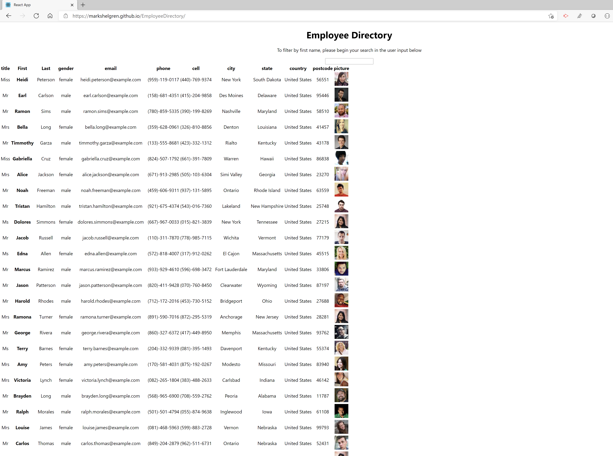

# Unit 19 React Homework: Employee Directory

--Homework 19 - React Homework: Employee Directory--

--User story--

As a user, I want to be able to view my entire employee directory at once so that I have quick access to their information.

--Getting Started--

clone this repo into your local and run 'npm i' in the root file of the folder.
This will install all neccesary dependancies and then type 'npm run start' in terminal to begin hosting locally.

--Built With--

M-E-R-N / Heroku / Bootstrap

--Authors--
Mark Shelgren

--Acknowledgments--
The teachers, trainers and central graders at UCI Full Stack Development Bootcamp# Unit 19 React Homework: Employee Directory

# Unit 19 React Homework: Employee Directory

--Homework 19 - React Homework: Employee Directory--

[Click here to open Deployed application:](https://markshelgren.github.io/EmployeeDirectory/)

GitHub Repo: https://github.com/markshelgren/EmployeeDirectory

Portfolio Page: https://github.com/markshelgren

## Table of contents

- [General info](#general-info)
- [User Story](#user-story)
- [Instruction](#instructions)
- [Business Context](#business-contect)
- [Acceptance Criteria](#acceptance)
- [Screenshots](#screenshots)
- [Features](#features)

## General info

Create an employee directory with React, breaking the application's UI into components, manage component state, and respond to user events.

## User Story

As a user, I want to be able to view my entire employee directory at once so that I have quick access to their information.

## Business Context

An employee or manager would benefit greatly from being able to view non-sensitive data about other employees. It would be particularly helpful to be able to filter employees by name.

## Screenshots

## Features

Given a table of random users generated from the [Random User API](https://randomuser.me/), when the user loads the page, a table of employees should render.

The user should be able to:

- Sort the table by at least one category

- Filter the users by at least one property.

## Getting Started

clone this repo into your local and run 'npm i' in the root file of the folder.
This will install all neccesary dependancies and then type 'npm run start' in terminal to begin hosting locally.

--Built With--

M-E-R-N

--Authors--
Mark Shelgren

--Acknowledgments--
The teachers, trainers and central graders at UCI Full Stack Development Bootcamp# Unit 19 React Homework: Employee Directory
